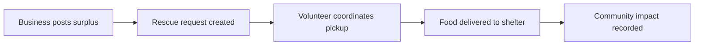

# Surplus-to-Shelter

> **Rescue good food before the clock runs out.**

Surplus-to-Shelter is a civic food-rescue platform that helps communities move surplus food from restaurants and local businesses to nearby shelters before it is wasted.

Built for the **AmiHacks NGO / Social Impact track**, the platform makes food rescue visible, actionable, and measurable. Donors can post available food, volunteers can coordinate pickup, and shelters can receive support through a shared operational workflow.


## Why It Matters

Prepared food often becomes waste because the people who have it, the people who can transport it, and the shelters that need it are not connected quickly enough.

Surplus-to-Shelter is designed around that time-sensitive handoff:

- Businesses can report surplus food quickly.
- Rescue requests can be prioritized by urgency and location.
- Volunteer drivers can coordinate pickup and delivery.
- Shelters can receive food through a structured request flow.
- Impact metrics make rescued meals and avoided waste visible.

## Core Experience



## Features

- Food rescue pickup request form
- Shelter and community destination workflow
- Supabase-backed request storage
- Responsive React interface
- Impact-focused rescue dashboard
- Visual, mission-driven presentation for hackathon demos
- Local fallback behavior when Supabase environment variables are not configured

## Technology

| Layer | Technology |
| --- | --- |
| Frontend | React 19 |
| Build tool | Vite 8 |
| Styling | CSS |
| Backend services | Supabase |
| Database | PostgreSQL through Supabase |
| 3D and visual experiences | Three.js, React Three Fiber |
| Code quality | Oxlint |

## Getting Started

### Requirements

- Node.js 20 or newer
- npm
- A Supabase project for persistent pickup requests

### Install and run

```bash
git clone https://github.com/paarth2538/surplus-to-shelter.git
cd surplus-to-shelter
npm install
npm run dev
```

Open the local URL printed by Vite in your browser.

## Supabase Setup

1. Create a project at [supabase.com](https://supabase.com).
2. Open the Supabase SQL Editor.
3. Run [`supabase/schema.sql`](supabase/schema.sql), then apply migrations `002_shelter_requests.sql`, `003_matching_engine.sql`, `004_phase6_pickup_workflow.sql`, and `005_phase7_live_tracking.sql` in order.
4. Copy `.env.example` to `.env.local`.
5. Add your Supabase project values:

```env
VITE_SUPABASE_URL=https://your-project-ref.supabase.co
VITE_SUPABASE_ANON_KEY=your-anon-key
```

6. Restart the Vite development server.

Without these variables, the interface still loads, but pickup submissions cannot be persisted to Supabase.

## Available Commands

```bash
npm run dev       # Start the development server
npm run build     # Create a production build
npm run preview   # Preview the production build locally
npm run lint      # Run Oxlint
```

## Repository Structure

```text
src/
├── components/   Reusable interface components
├── context/      Shared application state
├── lib/          Supabase client and application utilities
├── App.jsx       Main application experience
└── index.css     Global styles
supabase/
└── schema.sql    Database schema for pickup requests
public/           Static assets
```

## Project Documentation

| Document | Description |
| --- | --- |
| [PRD.md](PRD.md) | Product requirements, users, use cases, and success criteria |
| [Architecture.md](Architecture.md) | System architecture and data model |
| [design.md](design.md) | Visual design direction and accessibility goals |
| [phases.md](phases.md) | Hackathon delivery phases and roadmap |
| [rules.md](rules.md) | Engineering standards and project constraints |

## Demo Story

1. A local restaurant reports prepared surplus food.
2. The request becomes available for rescue coordination.
3. A volunteer accepts the pickup opportunity.
4. The food is delivered to a nearby shelter.
5. The impact view reflects the community value of the rescue.

## Safety and Privacy

- Never commit `.env.local` or API credentials.
- Only use the Supabase anonymous key in the browser.
- Apply database policies before production deployment.
- Avoid exposing personal information about shelter residents.
- Treat impact metrics as estimates unless verified by operational data.

## Roadmap

- [x] Responsive food rescue experience
- [x] Supabase pickup request integration
- [x] Database schema and local environment setup
- [ ] Role-specific donor, volunteer, and shelter dashboards
- [ ] Live route and distance support
- [ ] Delivery verification and chain of custody
- [ ] Expanded impact analytics
- [ ] Production accessibility and security audit

## Contributing

Contributions should keep the project focused on speed, dignity, accessibility, and measurable social impact. Please run the following checks before opening a pull request:

```bash
npm run lint
npm run build
```

## Acknowledgements

Surplus-to-Shelter is inspired by the organizations and volunteers working to redirect good food toward communities that need it.

---

**Build for the handoff that matters.**
